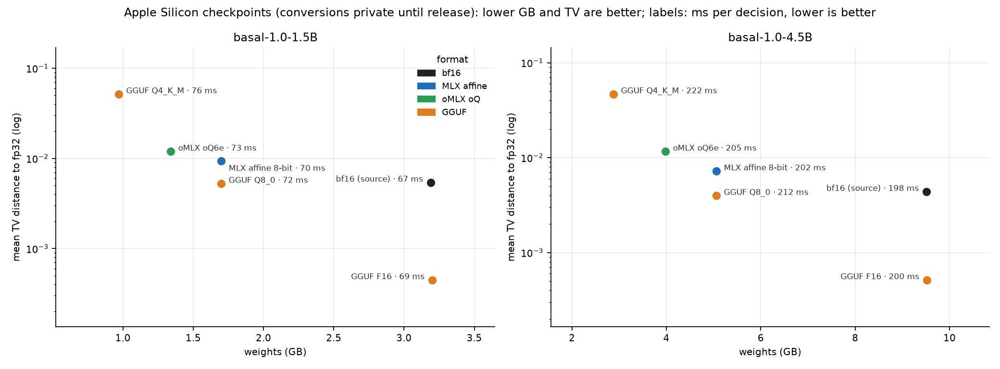

# GGUF / llama.cpp

`basal-serve --mode gguf` runs a basal checkpoint converted to GGUF through [llama.cpp](https://github.com/ggml-org/llama.cpp)
(via [llama-cpp-python](https://github.com/abetlen/llama-cpp-python)): Metal on Apple Silicon, CUDA or CPU elsewhere.
Only the weights come from the GGUF file. The tokenizer, chat template and `CALIBRATION.json` still come from `--model`
(the Hugging Face repository or a local copy), so the token ids are exactly those of the other backends. The two option
orders share their prefix as llama.cpp *sequences*: the prefix tokens belong to the sequences of both orders, each
order's option block to its own sequence, and all questions of a batch go through one `llama_decode`.

## Download

Converted files (F16, Q8_0, Q4_K_M, measured below; these repos are **private until the publisher releases them**):
[pawelkiszczak/basal-1.0-4.5B-GGUF](https://huggingface.co/pawelkiszczak/basal-1.0-4.5B-GGUF) and
[pawelkiszczak/basal-1.0-1.5B-GGUF](https://huggingface.co/pawelkiszczak/basal-1.0-1.5B-GGUF).

```bash
hf download pawelkiszczak/basal-1.0-4.5B-GGUF basal-1.0-4.5B-F16.gguf --local-dir .
```

## Convert yourself

The converter lives in llama.cpp and needs transformers 5 to read basal-1.0-1.5B's tokenizer config. Its current
`requirements-convert_hf_to_gguf.txt` pins transformers 4, so install the needed converter packages directly:

```bash
git clone --depth 1 https://github.com/ggml-org/llama.cpp ~/llama.cpp
uv venv --python 3.12 ~/gguf-env
uv pip install --python ~/gguf-env 'numpy~=2.2.6' 'sentencepiece>=0.1.98,<0.3.0' 'protobuf>=4.21,<5' gguf 'transformers==5.17.0' 'torch==2.11.0'
hf download Remek/basal-1.0-4.5B --local-dir basal-1.0-4.5B
~/gguf-env/bin/python ~/llama.cpp/convert_hf_to_gguf.py basal-1.0-4.5B --outtype f16  --outfile basal-1.0-4.5B-F16.gguf
~/gguf-env/bin/python ~/llama.cpp/convert_hf_to_gguf.py basal-1.0-4.5B --outtype q8_0 --outfile basal-1.0-4.5B-Q8_0.gguf
# other llama.cpp quantisations from the F16 file (llama-quantize: brew install llama.cpp, or build llama.cpp)
llama-quantize basal-1.0-4.5B-F16.gguf basal-1.0-4.5B-Q4_K_M.gguf Q4_K_M
```

The attention and MLP biases of basal-1.0 are converted and used by llama.cpp's Llama architecture.

## Serve

```bash
uv pip install -e ".[gguf]"          # llama-cpp-python 0.3.35 builds with Metal on macOS arm64
# For CUDA, use this INSTEAD of the line above (not tested with basal):
# CMAKE_ARGS="-DGGML_CUDA=on" uv pip install -e ".[gguf]" --no-binary llama-cpp-python
basal-serve --mode gguf --model Remek/basal-1.0-4.5B --gguf basal-1.0-4.5B-F16.gguf --port 8000
basal-bench --model Remek/basal-1.0-4.5B --modes eager-fp32 gguf@basal-1.0-4.5B-F16.gguf gguf@basal-1.0-4.5B-Q8_0.gguf
```

Early exit (`fast-exit`) is not available in this mode.

The general `[test]` extra does not install the native llama.cpp build. To run the GGUF-specific tests, opt in:

```bash
uv pip install -e ".[test,gguf]" gguf
pytest -q tests/test_gguf.py
```

For MLX-native checkpoints of the same models (8-bit, oQ6e; `--mode mlx`), see the
[README](../README.md#apple-silicon-mlx--mps).

## Which file

Apple M4 Max, 44 bundled examples, both option orders, every engine measured on prompts it has not seen before
after a 60 s GPU cool-down (the MacBook throttles under sustained load); *dec/s* with the remaining 21 decisions in one
call; *TV*: total-variation distance between the averaged two-order probabilities and the fp32 PyTorch reference
(mean / max over the items); `mlx` for comparison.

| model | mode | file | ms per decision | dec/s | agreement | TV mean / max |
|---|---|---|---|---|---|---|
| 4.5B | `gguf` F16 | 9.5 GB | 200 | **5.5** | 1.000 | **0.0006** / 0.004 |
| | `gguf` Q8_0 | 5.1 GB | 212 | 5.1 | 1.000 | 0.0039 / 0.038 |
| | `gguf` Q4_K_M | 2.9 GB | 222 | 4.9 | 0.955 | 0.047 / 0.307 |
| | `mlx` (bf16) | – | **198** | 5.1 | 1.000 | 0.0047 / 0.024 |
| 1.5B | `gguf` F16 | 3.2 GB | 69 | **16.7** | 1.000 | **0.0004** / 0.002 |
| | `gguf` Q8_0 | 1.7 GB | 72 | 15.9 | 0.977 | 0.0052 / 0.029 |
| | `gguf` Q4_K_M | 1.0 GB | 76 | 14.3 | 0.955 | 0.052 / 0.445 |
| | `mlx` (bf16) | – | **67** | 15.8 | 0.977 | 0.0061 / 0.027 |

- **F16** is the closest to the fp32 reference of all reduced-precision paths measured on Apple Silicon (most likely
  because llama.cpp keeps activations in fp32 between operations), at the speed of `mlx`: the recommended file.
- **Q8_0** halves the memory with bf16-level deviations (like `mlx-q8`).
- **Q4_K_M** changes about 5% of the decisions and moves single probabilities by up to 0.3–0.45: not recommended.
- Weight quantisation does not make prefill faster here: Apple GPUs are compute-bound on these prompts.



Per-item deviations of every variant and of other engines:
[HARDWARE.md, inference engines on Apple Silicon](HARDWARE.md#inference-engines-on-apple-silicon).

## Other llama.cpp front ends: send token ids

llama.cpp tokenizes text with the vocabulary stored in the GGUF file, and for basal that tokenization differs from the
Hugging Face tokenizer the models were trained with: on the bundled examples every prompt is split differently
(llama.cpp puts a word-boundary marker before the role names after `<|im_start|>` and chooses other merges inside Polish
words, e.g. `wybierają|c` instead of `wybiera|jąc`). Front ends that send text therefore shift the probabilities. On
the 1.5B F16 file, `llama-server` with text prompts: mean total-variation distance to fp32 0.061 (max 0.35), with
the Hugging Face token ids: 0.0005 (max 0.002). Ollama (GGUF import) and LM Studio, which accept only text, show the
same shift (0.049 / 0.31 on the 1.5B, 0.061 / 0.63 for LM Studio on the 4.5B).
`--mode gguf` always passes token ids. If you call `llama-server` yourself, tokenize with the Hugging Face tokenizer,
send `"prompt": [ids...]` to `/completion` with `n_predict: 1`, `n_probs: 20` and read the letter ids from
`completion_probabilities[0].top_logprobs`.
